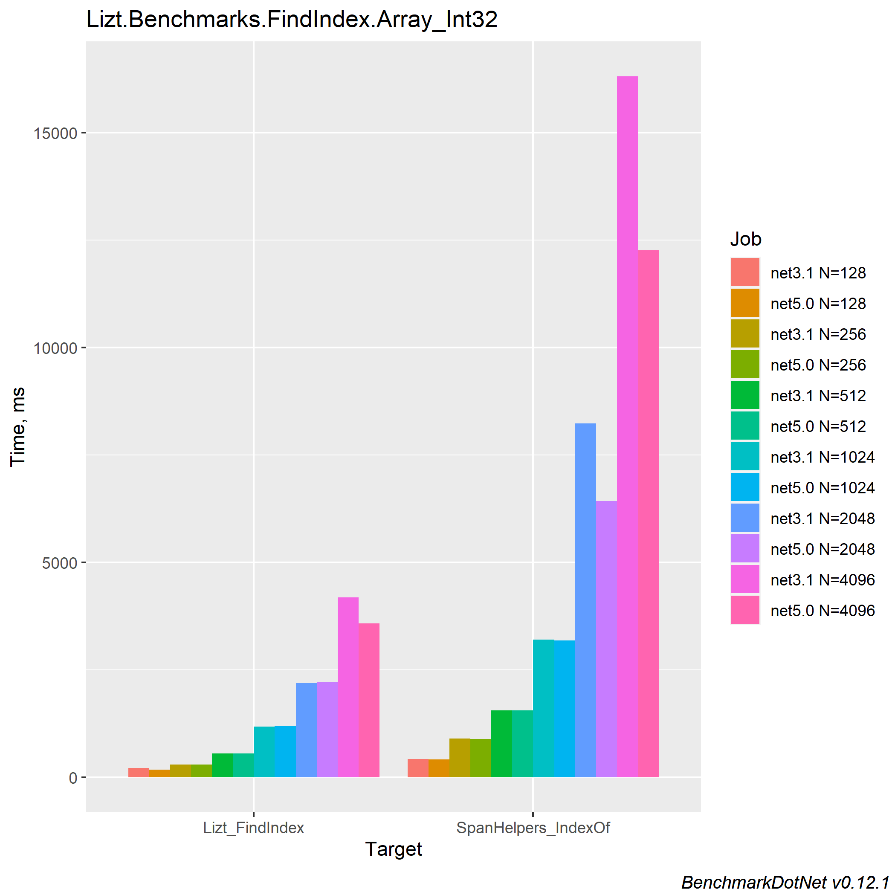

# Lizt

Lizt is a Proof-of-Concept SIMD accelerated library providing `Array` and `Span` extensions for built-in types. (Of actual benefit for 32-bit+ types)

## NOTE

This project was definitely a learning exercise and has largely been left public for posterity’s sake. As a first exposure to source generators not long after their release it doesn't follow current best practices, nor are the explanations of the SIMD logic _really_ the best. If I do continue this in the future it'll be under a different repo.

### Story Time

This repo came about as I was looking to experiment with benchmarking and performance code. It quickly turned into a crash course on intrinsics/SIMD + source generators and eventually implementing a "Find first match in slice" method. This initially seemed to yield great results when compared against the built in `FindIndex` method.

This felt far too good to be true... Which it was. The equivalent method I'd forgotten was `IndexOf`, which didn't make for such an optimistic comparison. On the plus side, I was on the right track as the bulk of my code was very similar to the MS implementation for 8 and 16 bit widths. Downside, the extra optimisations included put it pretty solidly out of my reach.

However, there's a small niche left to address - There's no built-in searching SIMD acceleration available for 32 and 64 bit types (ints, longs, floating points). There is yet speed to be had! :)

### Current State

The repo is very rough around the edges, but the initial work is there.

* Source generator producing SIMD implementation of `IndexOf`
* Uses the best instruction sets available on the underlying hardware
* Reasonable commenting on each step of the process
* Some speed benefits (see `docs\benchmarks`)

### ~~Future Work~~

* ~~Proper testing, especially around floating point equality~~
* ~~Proper benchmarking, remove experimenting benches~~
* ~~Investigate "off" results (EG. `long`, `ulong` being so slow)~~
* ~~Account for memory alignment~~
* ~~Look into the best use for `nint`, `nuint`~~
* ~~Speed-up from X64 varient of intrinsics?~~
* ~~Confirm that pinning is _really_ necessary~~
* ~~Rename `FindIndex` to `IndexOf`~~
* ~~Write ARM instruction set equivalent (need an ARM machine...)~~
* ~~Learn and write other SIMD methods :)~~

### AVX2 `int` Comparison

